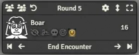
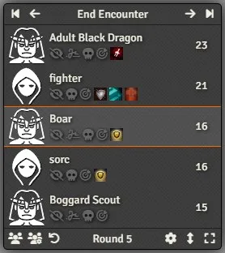

# FoundryVTT Mini Tracker

This module adds an extra floating `Combat Tracker` which provides new functionalities.

# Displayed when needed

The tracker will automatically appear on screen when there is an active encounter containing a combatant owned by the user (any combatant will do for the GM).

The tracker will be removed when those conditions are not met anymore.

# Minimized

The tracker is by default minimized to only display the current combatant and the header (also footer for the GM), this allow for a very discreet tracker that can be placed in a corner of the screen.

While minimized, the user can mouse over the combatant to expand the tracker temporarily, the delay before expansion can be set (default 250ms).

# Expanded

The tracker can be expanded to a regular size either by hovering over the tracker or by clicking 

In that state, the tracker will reproduce the behavior of the normal combat tracker with the same features and color coding.

While expanded, you can reduce its size by dragging the extremity of the tracker (opposite to the header).

# Change Orientation

The user can change the expanded orientation of the tracker by clicking 

This will reverse the entire tracker, placing the header at the bottom (footer at the top for the GM) and expand the tracker upward instead of downward, this is useful if the user wants the tracker to be anchored at the bottom of the screen.

# Saved

Position, orientation, minimized/expanded and size limite of the tracker are all saved on the user's browser between sessions.

# Change initiative by dragging combatant

The tracker allow the GM to reorganize and change the initiative of a combatant simply by dragging them inside the tracker: Click and hold the left-click for a short time and start dragging a combatant to another position.

This will set a new initiative for the combatant, using decimals when needed (which may or may not be shown in the tracker depending on the system).

# Hide creatures name

If a recognized module/system allowing hidding creatures names is found, the name of the creatures will be hidden from the players when appropriate.

It will also add a new  icon to show the GM the current state, also allowing its toggle if possible.

## Systems

-   [Pathfinder Second Edition (Official)](https://foundryvtt.com/packages/pf2e)

## Modules

-   [Anonymous](https://foundryvtt.com/packages/anonymous)

# Settings

## Enabled (client)

Enabel of disable the mini tracker for the user.

## Hover Delay (client)

Set the amount of time (in milliseconds) before the tracker starts extending on mouse hover.

## Pan to Token

When enabled, the GM's screen will center on the token of the combatant whose turn it is.

## Select Token

When enabled, the token of the combatant whose turn it is will automatically select on the GM's client.

## Open Sheet

When enabled, the actor sheet of the combatant whose turn it is will automatically be opened on the GM's client.
